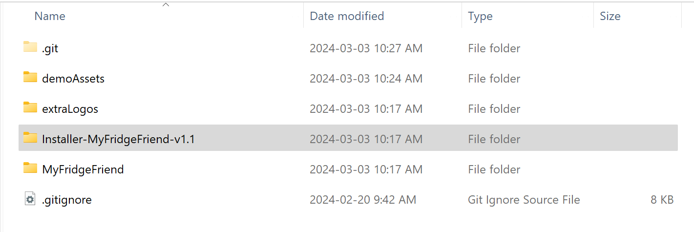
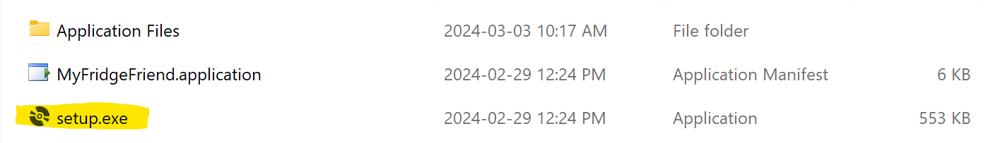

# MyFridgeFriend

MyFridgeFriend is an app built in C#/.Net Framework and WPF. Designed to work with an Azure SQL database, the app tracks and manages the quantity of food and their expiration dates. Products can be added manually or via barcode (Built using ZXing & upcItemDb API), while a filtered list of products can be either printed or exported to CSV. 

MyFridgeFriend was built in collaboration with @sophiephie and @cirque-du-soli

## Installation

Use the installer!

## Usage
**Main Page** 
 
**List of Products, with dynamic search and filters** 
 
**Adding Products, with barcode scanner and image** 
 
**Deleting Products, with multi-select** 
 
**Editing Products** 
 
**Printing/Exporting Product List, with filters** 
 
**List of Transactions (Stock Movements)** 
 
## License

[MIT](https://choosealicense.com/licenses/mit/)
